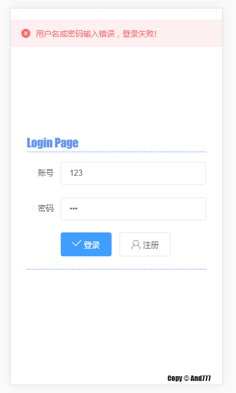
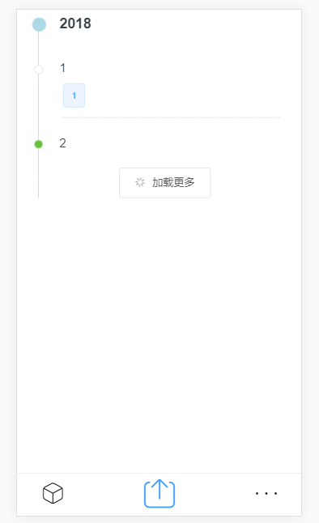
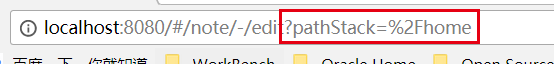
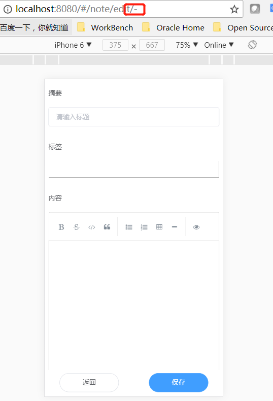
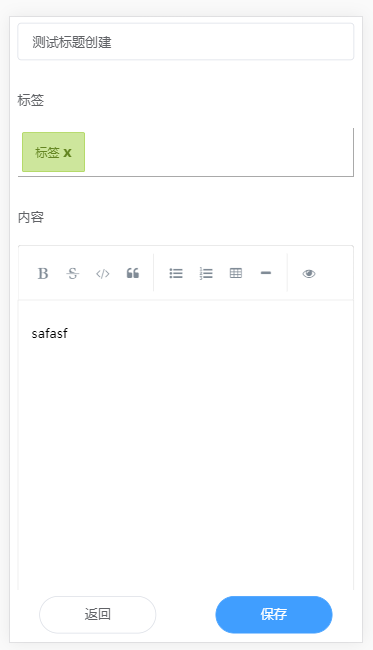
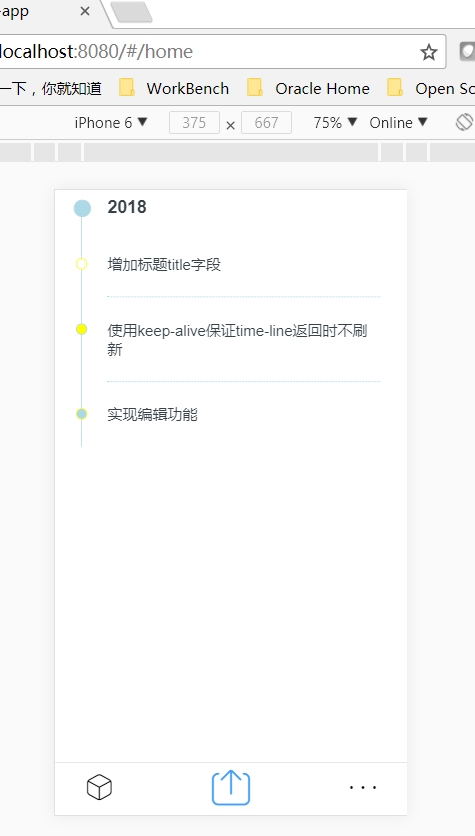
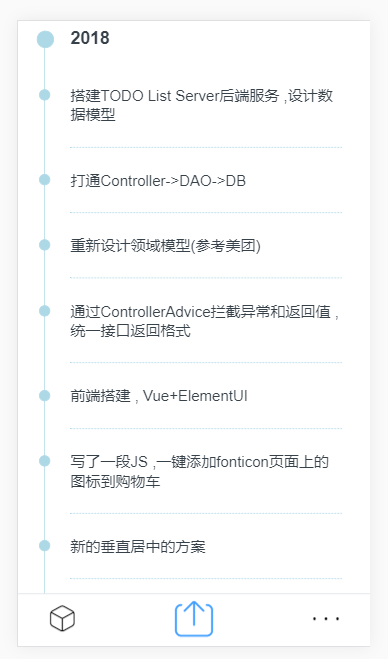

# Time is RUNNING 

[](https://travis-ci.org/Anddd7/vue-sample)

一个 TODO List, 作为 Vue 的Sample和脚手架项目 

### todolist-web-app
前端WebApp部分代码
- Vue
- ElementUI

### 20180515
- 合并原vue-sample和todo-list-app
- 暂时搁置, 项目架构不完善

### 20180228

- 权限改造
  - 登录用户校验
  - 接口调用校验 ,未登录直接返回登录界面
- 接口调用改造
  - 拦截axios的promise链 ,对指定的http-code进行预处理
  - 统一服务器和应用异常处理 ,并通过新的promise.catch进行处理
```javascript
function checkHttpStatus(axiosPromise) {
  return new Promise(function (resolve, reject) {
    axiosPromise.then(res => {
        if (res.status === 200 || res.status === 304) {
          return resolve(res.data);
        }

        /**
         * 对指定Code全局处理
         */
        if (res.status === 401) {
          //...
        } else if (res.status === 500) {
          //...
        }

        /**
         * 其他Code传递到promise链中
         */
        let error = res.data;
        error.status = res.status;
        reject(error);
      }
    );
  });
}

export default {
  get: function (url, data) {
    return checkHttpStatus(
      axios.get(`${apiURL}${url}${formatParameters(data)}`));
  }
}
```
```javascript
this.$Rest.get('',{})
  .then(res => {
    //...
  })
  .catch(err => {
    //...
    Message.error(err.msg);
  });
```

### 20180226


- 支持分页查询TimeLine的内容 ,并按年份分隔
- 修正Router跳转关系 ,使用路径栈进行暂存
  - home -(create)-> edit -(cancel)-> home
  - home -(read)-> info -(cancel)-> home
  - home -(create)-> edit-> -(save)-> info -(cancel)-> home

### 20180223


- 完成笔记消息的 创建/编辑 功能
- 标签输入 基于 [input-tags](https://github.com/matiastucci/vue-input-tag)
- Markdown编辑器 基于 [SimpleMDE](https://github.com/F-loat/vue-simplemde)


- 增加title字段 ,用于timeline显示简述信息
- 使用keep-live ,保证router切换时time-line不会重复加载耗费资源

### 20180212

搭好了基础结构 ,成功链接到后端服务 ,并输出一个时间轴
- 时间轴源码基于 [vue-cute-timeline](https://github.com/luyilin/vue-cute-timeline)
